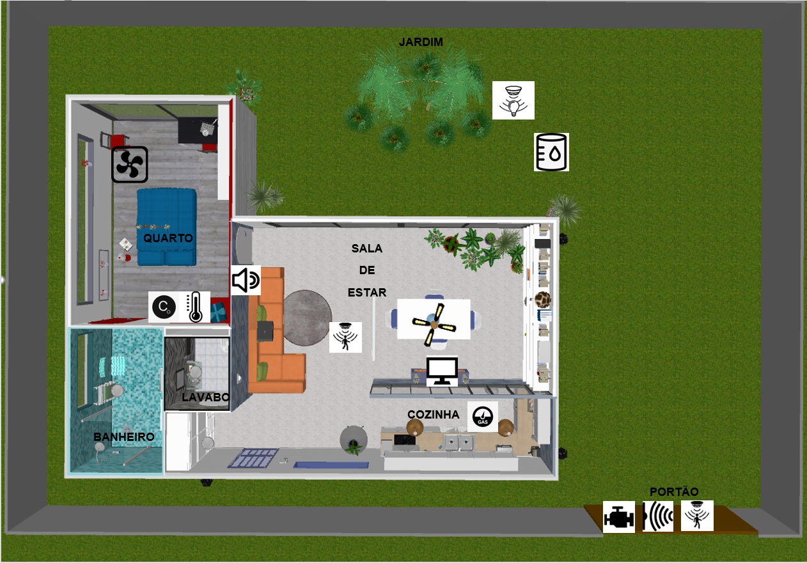

# Design

Neste projeto, pretende-se construir um protótipo de casa automática. Logo, iremos começar a listar os componentes que serão necessários para realizar as utilidades que foram previstas na parte de concepção.
Seguem abaixo uma tabela dos componentes que serão utilizados e a maquete eletrônica do projeto, com todos os seus componentes e ligações.

## Componentes necessários 

Nesta tabela estão listados todos os componenetes que serão utilizados com suas respectivas conectividades. Vale lembrar que além dos componentes serão utilizados fios para fazer suas respextivas conexões.
Quantidade  | Componente
:---------: | ------
1           | Placa Arduino MEGA 2560 R3 + Fonte + Cabo USB para Arduino
1           | Sensor de Umidade e Temperatura DHT11
2           | Sensor de presença e movimento PIR           
1           | Sensor de gás MQ-2 inflamável e fumaça
1           | Micro Servo SG92R 9g TowerPro
1           | Módulo Sensor de Umidade/Nível Água Chuva
1           | Módulo Relé 5 V e um Canal
1           | Sensor ultrasônico HC-SR04
1           | Módulo Matriz de LED 8×8 com MAX7219
1           | Buzzer passivo
1           | Display LCD 16×2 I2C Backlight Azul
1           | Cooler
1           | LDR
1           | Resistor 10k ohms

### Os componentes eletrônicos em questão funcionam da seguinte forma:

**-Placa MEGA 2560 R3** (Arduino)
Basicamente será o “tradutor” dos sinais, ele irá receber os sinais a partir de suas entradas e, dependendo a entrada que receber o sinal, saídas específicas serão ativadas.

**-Sensor de Umidade e Temperatura DHT11**
Realiza a aferição da Humidade e da temperatura do ambiente em que está localizado.

**-Sensor de presença e movimento PIR**
Faz a leitura de movimentação no ambiente e envia um sinal por um curto período de tempo quando detecta movimentação no local.

**-Sensor de gás MQ-2 inflamável e fumaça**
Realiza a leitura da concentração de gás e fumaça no ar, caso esta concentração esteja acima de um limite definido a partir do potenciômetro e informa no caso de ter passado este limite. 

**-Micro Servo SG92R 9g TowerPro** (Motor)
Motor com engrenagens que irá ligar ao receber uma alimentação.

**-Módulo Sensor de Umidade/Nível Água Chuva**
Sensor que detecta umidade e nível de água.

**-Módulo Relé 5 V e um Canal**
Relé que será responsável para ligar o motor.

**-Sensor ultrasônico HC-SR04**
Sensor de distância, para calcular com precisão distâncias entre 2 cm e 4 m.

**-Módulo Matriz de LED 8×8 com MAX7219**
Placa de leds que poderá eventualmente mostrar alguma mensagem mais simples, como por exemplo a leitura de temperatura e umidade.

**-Buzzer passivo**
Será o “alto falante” do sistema, para emitir sons quando for necessário.

**-Display LCD 16×2 I2C Backlight Azul**
Poderá se comunicar com o usuário mais detalhadamente, como por exemplo: "Vazamento de gás detectado".

## Maquete Eletrônica
A figura abaixo mostra como os componentes ficarão conectados ao arduino.

## Planta Baixa
A figura abaixo mostra a planta baixa do modelo que irá demonstrar o funcionamento do projeto.

## Referências
PLACA Mega 2560 R3 Arduino. Disponível em: <https://www.usinainfo.com.br/placas-arduino/placa-mega-2560-r3-arduino-cabo-usb-3629.html>. Acesso em: 02 nov. 2021.
FILIPEFLOP. Filipeflop. Disponível em: <https://www.filipeflop.com/>. Acesso em: 02 nov. 2021.

ELETRÔNICA CASTRO. MODULO SENSOR DE UMIDADE NIVEL AGUA CHUVA ARDUINO. Disponível em: <https://www.eletronicacastro.com.br/arduino/14906-modulo-sensor-de-umidade-nivel-agua-chuva-ardui-0000000149068.html>. Acesso em: 02 nov. 2021.
