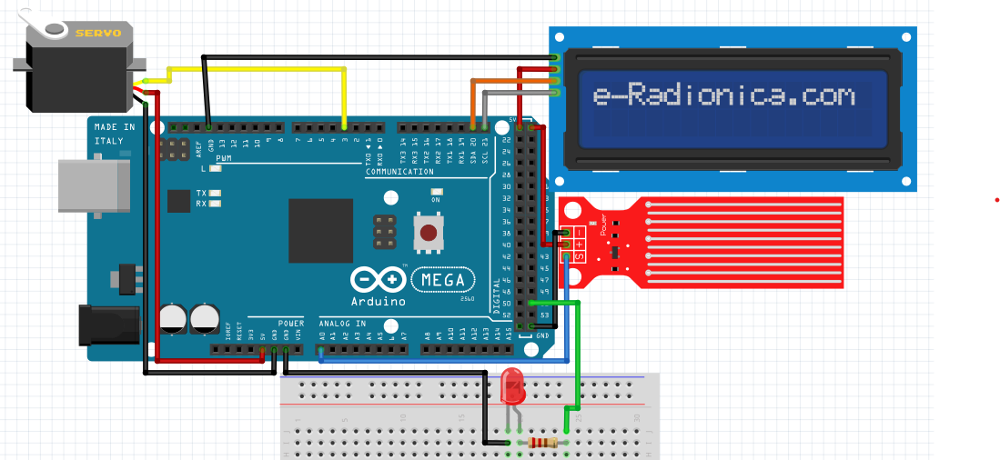
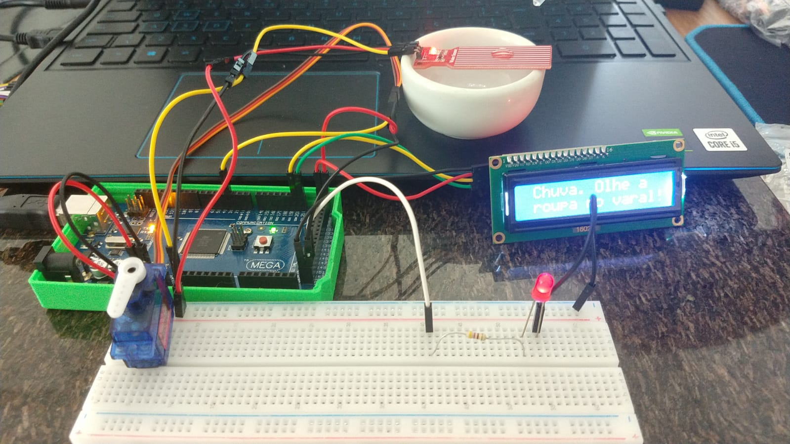

# Sistema de detecção de chuva

Para o sistema de detecção de chuva, foram utilizados o sensor de nível de água, um servo motor, um led e o display LCD. Quando o sensor de nível de água detecta um valor considerável de água (maior que 300), ele ativa o servo para fechar a janela, acende o LED, e informa no display LCD que está chovendo e orienta a verificar a roupa no varal.
Neste código também é possível pela comunicação serial, abrir ou fechar a janela controlada pelo servo apertando a tecla "j" no teclado.

Abaixo temos o modelo de como o circuito foi montado com o código.


Montando o circuito conforme mostrado acima e utilizando o código abaixo na IDE do arduíno, o sistema irá funcionar de acordo com o que foi explicado anteriormente.

Código utilizado:

```C
// Definição dos pinos
#define PINO_SENSOR_AGUA A0
#define LED 51
#define JANELAPIN 3

//biblioteca
#include <Servo.h>
#include <Wire.h> // biblioteca LCD
#include <LiquidCrystal_I2C.h> //biblioteca LCD

// Nomeando o servo da janela
Servo JANELA;
// Define o endereço LCD para 0x27 para um display de 16 caracteres e 2 linhas
LiquidCrystal_I2C lcd(0x27, 20, 4);

// Armazena a posição do servo da janela
int pos = 0;

// Função setup é executada apenas uma vez
void setup() {
  // inicia a comunicação serial a 9600 bits por segundo
  Serial.begin(9600);
  // Configura o pino do LED como saída
  pinMode (LED, OUTPUT);

  //Porta onde o servo da janela está conectado
  JANELA.attach(JANELAPIN);

  // inicializa o LCD
  lcd.init();
  //liga a luz de fundo
  lcd.backlight();

}

/* Essas variáveis são globais pois é necessário
   manter os valores independente do contexto de
   execução da função tarefa_1 */
const unsigned long periodo_tarefa_1 = 1000;
unsigned long tempo_tarefa_1 = millis();

bool abre_janela = false;
bool ligar_LCD = false;
bool msg_chuva = false;


/* Função loop() é responsável por escalonar as tarefas.
   Essa função é executada eternamente enquanto o Arduino estiver  energizado */
void loop() {
  tarefa_janela();
  tarefa_lcd();
  tarefa_agua();
  tarefa_serial();
}

void tarefa_agua() {
  unsigned long tempo_atual = millis();

  int valorSensor;

  /* Hora de enviar os dados analógicos caso tenha passado 1000 ms */
  if (tempo_atual - tempo_tarefa_1 > periodo_tarefa_1) {
    tempo_tarefa_1 = tempo_atual;

    valorSensor = analogRead(PINO_SENSOR_AGUA);

    Serial.print("Valor : ");
    Serial.println(valorSensor);

    //Acender o LED de acordo com o valor da entrada analógica
    if (valorSensor > 300) {
      digitalWrite(LED, HIGH);
      ligar_LCD = true;
      abre_janela = true;
      msg_chuva = true;
    }
    else {
      digitalWrite(LED, LOW);
      msg_chuva = false;
      ligar_LCD = false;
    }
  }
}

/* Gerencia os comandos da porta serial */
void tarefa_serial() {

  /* Caso tenha recebido algum dado do PC */
  if (Serial.available()) {
    char dado_recebido = Serial.read();

    /* Depuração */
    Serial.print("Recebido:");
    Serial.println(dado_recebido);

    if (dado_recebido == 'j') { // abre ou fecha a janela
      if (abre_janela == true)
        abre_janela = false;
      else
        abre_janela = true;
    }

  }
}

void tarefa_janela() {

  JANELA.write(pos);
  if (abre_janela == true) {
    if (pos < 180) {
      for (pos = 0; pos <= 180; pos += 1) {
        // Troca de posição
        JANELA.write(pos);
        // Aguarda 10 ms
        delay(10);
      }
    }
  }
  else {
    if (pos > 0) {
      for (pos = 180; pos >= 0; pos -= 1) {
        // Troca de posição
        JANELA.write(pos);
        delay(10);
      }
    }
  }
}

void tarefa_lcd() {
  if (ligar_LCD == true) {
    if ( msg_chuva == true) {
      lcd.setCursor(1, 0);
      lcd.print("Chuva, olhe a");
      lcd.setCursor(1, 1);
      lcd.print("roupa no varal!");
    }
  }
  else
    lcd.clear();
}
```


Segue abaixo uma foto do circuito funcional:




