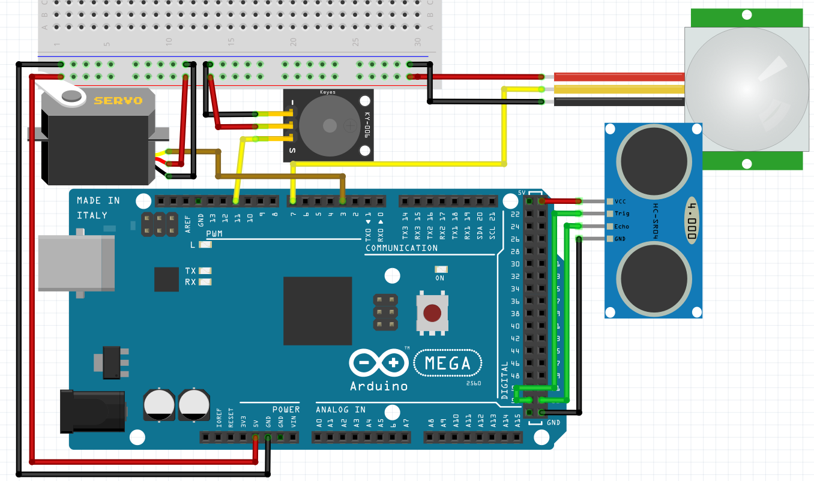
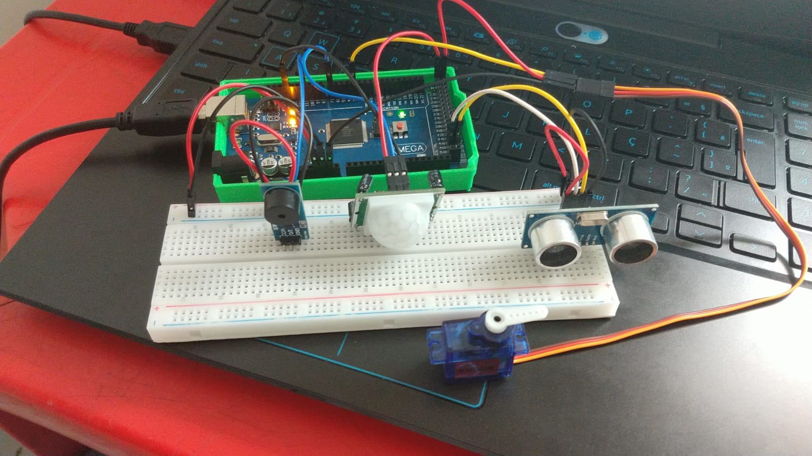

# Sistema de campainha e controle do portão
Para realizar o sistema de campainha junto com o controle do portão, foram utilizados o buzzer, um servo motor, um sensor PIR e o sensor ultrassônico HC-SR04. Neste sistema, é utilizado o sensor PIR e o HC-SR04 juntos para verificar se há presença no portão, quando o sensor PIR percebe movimentação e o HC-SR04 aponta uma distância abaixo de um limite especificado (4 cm para os testes e a maquete), o buzzer é acionado para sinalizar que há alguém  no portão. Ao pressionar a tecla "p" no monitor serial, o sistema faz com que o portão abra ou feche. Caso o portão seja aberto em um momento em que a campainha estiver ligada, o código também faz com que a campainha desative.

Segue abaixo um exemplo de como o circuito pode ser montado:




Juntando o circuito acima e o código abaixo, é possível ter o sistema funcionando da forma que foi explicado no início.

Código utilizado:
```C
// Inclui a biblioteca
#include <Servo.h>
//Carrega a biblioteca do sensor ultrassonico
#include <Ultrasonic.h>

#define PINO_BUZZER 11

// Pino digital onde está conectado o servo
#define SERVOPIN 3
// Define o PIR com o valor "7" que é onde o pino digital está conectado
#define pirPORTAO 7

//Define os pinos para o trigger e echo do sensor de proximidade
#define pino_trigger 52
#define pino_echo 53


// Nomeando o servo
Servo PORTAO;
//Inicializa o sensor de proximidade
Ultrasonic ultrasonic(pino_trigger, pino_echo);

// Armazena a posição do servo do portão
int posp = 0;

// Função setup é executada apenas uma vez
void setup()
{
  // Inicia a comunicação serial a 9600 bits por segundo
  Serial.begin(9600);
  while (!Serial);

  // Configura o pino como entrada
  pinMode (pirPORTAO, INPUT);

  //Porta onde o servo está conectado
  PORTAO.attach(SERVOPIN);

  /* Configuração dos pinos como entrada ou saída */
  pinMode(PINO_BUZZER, OUTPUT);

  /* Mantém buzzer desligado se acionamento for PNP
     Troque para HIGH para LOW caso NPN
  */
  digitalWrite(PINO_BUZZER, HIGH );
}

bool abre_portao = false;

/* Essas variáveis são globais pois é necessário
   manter os valores indenpendente do contexto de
   execução da função tarefa_1 */
const unsigned long periodo_tarefa_1 = 1000;
unsigned long tempo_tarefa_1 = 0;
int estado_alarme = LOW;
bool ligar_alarme = false;

// Função loop é para executar repetidamente o código
void loop()
{
  tarefa_buzzer();
  tarefa_portao();
  tarefa_serial();
  tarefa_visita();
}


void tarefa_portao() {
  PORTAO.write(posp);
  if (abre_portao == true) {
    if (posp < 90) {
      for (posp = 0; posp <= 90; posp += 1) {
        // Troca de posição
        PORTAO.write(posp);
        // Aguarda 10 ms
        delay(10);
      }
    }
  }
  else {
    if (posp > 0) {
      for (posp = 90; posp >= 0; posp -= 1) {
        // Troca de posição
        PORTAO.write(posp);
        // Aguarda 10 ms
        delay(10);
      }
    }
  }
}

void tarefa_serial() {

  /* Caso tenha recebido algum dado do PC */
  if (Serial.available()) {
    char dado_recebido = Serial.read();

    /* Depuração */
    Serial.print("Recebido:");
    Serial.println(dado_recebido);

    if (dado_recebido == 'p') { // abre ou fecha o portão
      if (abre_portao == true)
        abre_portao = false;
      else {
        if (ligar_alarme == true)
          ligar_alarme = false;
        abre_portao = true;
      }
    }
  }
}

void tarefa_visita() {
  float cmMsec;
  cmMsec = ultrasonic.distanceRead(CM);

  // Se houver movimento próximo do portão
  if ((digitalRead(pirPORTAO) == HIGH) && cmMsec <= 4 ) {
    // Enviar para monitor serial
    Serial.println("Presença detectada no portão");
    ligar_alarme = true;
  } else {
    // Se não houver movimento enviar para monitor serial
    Serial.println("-----");
  }
}

void tarefa_buzzer() {

  unsigned long tempo_atual = millis();

  /* Hora de executa essa tarefa */
  if (tempo_atual - tempo_tarefa_1 > periodo_tarefa_1) {

    tempo_tarefa_1 = tempo_atual;

    if (ligar_alarme == true) {

      if (estado_alarme == HIGH) {
        estado_alarme = LOW;
        tone(PINO_BUZZER, 2000);
      }
      else {
        estado_alarme = HIGH;

        /* Depende do Buzzer:
           Se acionado com NPN, use apenas noTone(PINO_BUZZER);
           Se acionado com PNP, use abaixo para deixar o pino em nível alto.
            noTone(PINO_BUZZER);
            digitalWrite(PINO_BUZZER, HIGH);
        */
        noTone(PINO_BUZZER);
        digitalWrite(PINO_BUZZER, HIGH);
      }

    }
    else {
      noTone(PINO_BUZZER);
      digitalWrite(PINO_BUZZER, HIGH);
    }
  }


}
```
Segue abaixo uma foto do circuito montado e funcional.


