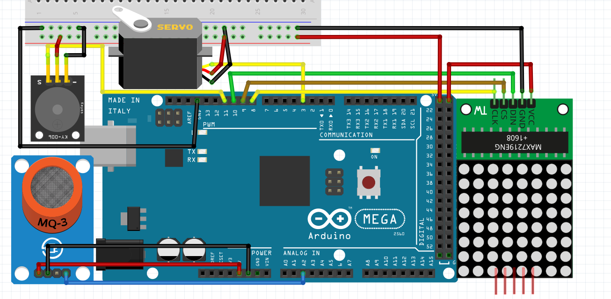
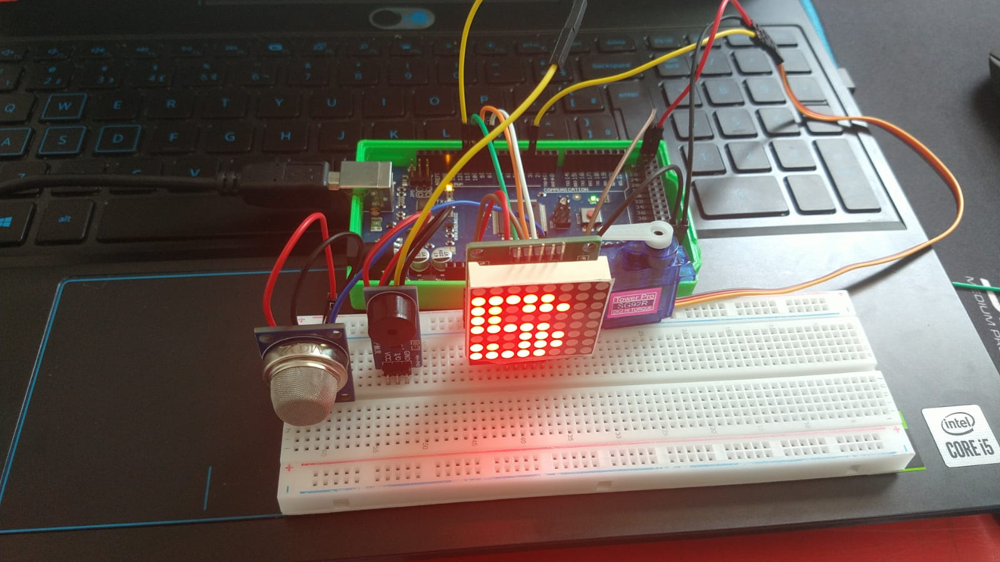

# Sistema de monitoramento do vazamento de gás
Para o sistema de monitoramento de gás, foram utilizados o sensor de gás MQ2, a matriz de LEDs, um servo motor e o buzzer. Nesta configuração, o sensor de gás envia um valor maior ao arduíno quanto maior a concenração de gás que ele detecta, portanto, quando chega a um valor maior que o estipulado(neste caso 400), o servo motor abre a janela para evitar o acúmulo de gás, a matriz mostra a mensagem "GAS" e o buzzer dispara. Mesmo que a concentração de gás diminua, o buzzer e a matriz continuam ligados, e só são desligados se o usuário apertar a tecla "a", para garantir que seja checado o vazamento de gás antes que o alarme pare.

Segue abaixo um exemplo de como o cirucito pode ser montado.



Utilizando o circuito do exemplo junto com o código que está abaixo, é possível ter o sistema funcionando.

Este é o código que foi utilizado:
```C
#define ENTRADA_GAS A2
#define PINO_BUZZER 11
#define JANELAPIN 3


// Inclui a biblioteca
#include <MatrizLed.h>
#include <Servo.h>

// Nomeando a matriz de led
MatrizLed matriz;

// Nomeando o servo da janela
Servo JANELA;

// Recebe a leitura feita no pino analógico do sensor de gás
int aSensor;
// Armazena a posição do servo da janela
int pos = 0;

// Função setup é executada apenas uma vez
void setup()
{
  // Inicia a comunicação serial a 9600 bits por segundo
  Serial.begin(9600);
  while (!Serial);

  /* Configuração dos pinos como entrada ou saída */
  pinMode(PINO_BUZZER, OUTPUT);

  /* Mantém buzzer desligado se acionamento for PNP
     Troque para HIGH para LOW caso NPN
  */
  digitalWrite(PINO_BUZZER, HIGH);

  // dataPin, clkPin, csPin, numero de matrizes de 8x8
  matriz.begin(10, 8, 9, 2);
  // Caso ocorra falha
  matriz.rotar(false);

  //Porta onde o servo está conectado
  JANELA.attach(JANELAPIN);
}

// Função loop é para executar repetidamente o código
void loop()
{
  tarefa_janela();
  tarefa_buzzer();
  tarefa_matriz();
  tarefa_gas();
  tarefa_serial();
}


/* Essas variáveis são globais pois é necessário
   manter os valores independente do contexto de
   execução da função tarefa_1 */
const unsigned long periodo_tarefa_1 = 1000;
unsigned long tempo_tarefa_1 = millis();

bool ligar_matriz = false;
bool msg_gas = false;

int estado_alarme = LOW;
bool ligar_alarme = false;

bool abre_janela = false;


//Envia os valores interios para o PC
void tarefa_gas() {
  unsigned long tempo_atual = millis ();

  //Hora de enviar os dados caso tenha passado 1000 ms
  if (tempo_atual - tempo_tarefa_1 > periodo_tarefa_1) {

    // Faz a leitura do sensor
    aSensor = analogRead(ENTRADA_GAS);

    // Envia para o computador (serial) os dados
    Serial.print("Leitura entrada analógica: ");
    Serial.println(aSensor);
    Serial.println();

    if (aSensor >= 400) {
      ligar_alarme = true;
      ligar_matriz = true;
      msg_gas = true;
      abre_janela = true;

    }
  }
}

void tarefa_matriz() {
  matriz.borrar();
  if (ligar_matriz == true) {
    if (msg_gas == true) {
      matriz.escribirFraseScroll("GAS", 65);
    }
  }
}

void tarefa_buzzer() {

  unsigned long tempo_atual = millis();

  /* Hora de executa essa tarefa */
  if (tempo_atual - tempo_tarefa_1 > periodo_tarefa_1) {

    tempo_tarefa_1 = tempo_atual;

    if (ligar_alarme == true) {

      if (estado_alarme == HIGH) {
        estado_alarme = LOW;
        tone(PINO_BUZZER, 2000);
      }
      else {
        estado_alarme = HIGH;

        /* Depende do Buzzer:
           Se acionado com NPN, use apenas noTone(PINO_BUZZER);
           Se acionado com PNP, use abaixo para deixar o pino em nível alto.
            noTone(PINO_BUZZER);
            digitalWrite(PINO_BUZZER, HIGH);
        */
        noTone(PINO_BUZZER);
        digitalWrite(PINO_BUZZER, HIGH);
      }

    }
    else {
      noTone(PINO_BUZZER);
      digitalWrite(PINO_BUZZER, HIGH);
    }
  }

}

/* Tarefa 2: gerencia os comandos da porta serial */
void tarefa_serial() {

  /* Caso tenha recebido algum dado do PC */
  if (Serial.available()) {
    char dado_recebido = Serial.read();

    /* Depuração */
    Serial.print("Recebido:");
    Serial.println(dado_recebido);

    if (dado_recebido == 'a') { // desliga alarme e mensagem da matriz
      if (ligar_alarme == true)
        ligar_alarme = false;
      if (ligar_matriz == true)
        ligar_matriz = false;
      if (msg_gas == true)
        msg_gas = false;
    }

    if (dado_recebido == 'j') { // abre ou fecha a janela
      if (abre_janela == true)
        abre_janela = false;
      else
        abre_janela = true;
    }

  }
}

void tarefa_janela() {

  JANELA.write(pos);
  if (abre_janela == true) {
    if (pos < 180) {
      for (pos = 0; pos <= 180; pos += 1) {
        // Troca de posição
        JANELA.write(pos);
        // Aguarda 10 ms
        delay(10);
      }
    }
  }
  else {
    if (pos > 0) {
      for (pos = 180; pos >= 0; pos -= 1) {
        // Troca de posição
        JANELA.write(pos);
        // Aguarda 10 ms
        delay(10);
      }
    }
  }
}
```

Segue abaixo uma foto do circuito funcional.

