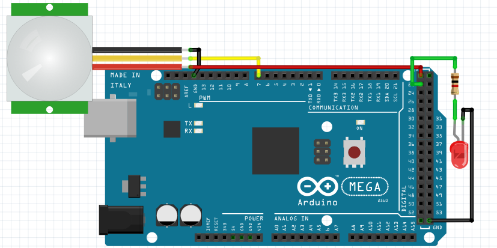
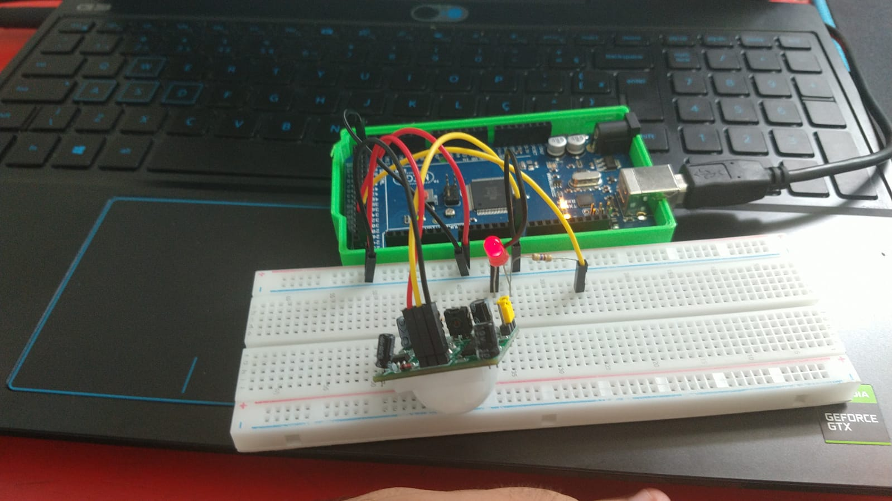

# Iluminação por detecção de movimento
Neste sistema, são utilizados o sensor PIR e um LED. quando o sensor PIR detecta movimento, o LED é acionado.

Abaixo temos um exemplo de como montar o circuito.


Utilizando o circuito exemplo e o cósigo abaixo, temos o sistema funonal.
Código utilizado:
```C
#define pinPIR 7 // Define o PIR com o valor "7" que é onde o pino digital está conectado
#define LUZ 22 // Define o pino do led de luz no valor "22"

// Função setup é executada apenas uma vez
void setup() 
{
  // Configura o pino como entrada
  pinMode (pinPIR, INPUT);
  
  // Configura o pino do LED como saída
  pinMode (LUZ, OUTPUT);
    
  // inicia a comunicação serial a 9600 bits por segundo
  Serial.begin(9600);
}

// Função loop é para executar repetidamente o código
void loop()
{
  // Se houver movimento
  if (digitalRead(pinPIR) == HIGH) {
    // Enviar para monitor serial
    Serial.println("Presença detectada");
    digitalWrite(LUZ, HIGH); // acender luz
  } else {
    // Se não houver movimento enviar para monitor serial
    Serial.println("-----");
    digitalWrite(LUZ,LOW); //apagar luz
  }
}

```
Abaixo há uma imagem no circuito montado e funcional.

