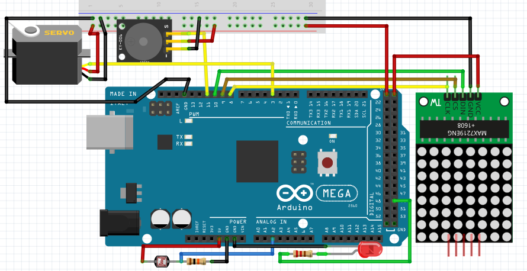
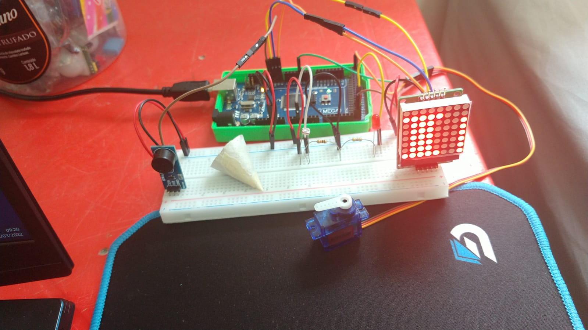

# Despertador e iluminação do jardim
Para este sistema, são utilizados LDR, LED, matriz de LEDs, buzzer, e um servo motor. Como o LDR aumenta o valor enviado ao arduíno quanto maior a luminosidade do local, enquanto ele está em um valor considerado "escuro"(neste caso abaixo de 400), o led do jardim é ligado para iluminar aquele local, quando fica claro, o led apaga. è configurada também uma função de "despertador". O usuário utiliza a tecla "d" do teclado para ativar e desativar este despertador, com ele ativado, no momento que o LDR recebe luminosidade suficiente para identificar que amanhaceu, a janela é aberta e o buzzer envia o alarme sonoro, junto com isso, a matriz de LEDs mostra a mensagem "BOM DIA".

Abaixo temos o exemplo de como o circuito pode ser montado.


Na utilização do circuito exemplo junto com o código abaixo, é possível ter o sistema funconal.

Còdigo utilizado:
```C
// Inclui a biblioteca
#include <Servo.h>
#include <MatrizLed.h>

// Define a entrada analógica 0 conectada ao sensor
#define PINO_LDR A2
// Define o pino "13" onde o LED está conectado
#define LED_JARDIM 49
// Pino digital onde está conectado o servo da janela
#define JANELAPIN 3
#define PINO_BUZZER 11

// Nomeando a matriz de led
MatrizLed matriz;
// Nomeando o servo da janela
Servo JANELA;

// Armazena a posição do servo da janela
int pos = 0;

#define DEBUG

// Função setup é executada apenas uma vez
void setup() {
  // inicia a comunicação serial a 9600 bits por segundo
  Serial.begin(9600);

  while (!Serial);
  // Configura o pino do LED como saída
  pinMode (LED_JARDIM, OUTPUT);

  /* Configuração dos pinos como entrada ou saída */
  pinMode(PINO_BUZZER, OUTPUT);

  /* Mantém buzzer desligado se acionamento for PNP
     Troque para HIGH para LOW caso NPN
  */
  digitalWrite(PINO_BUZZER, HIGH);


  // dataPin, clkPin, csPin, numero de matrizes de 8x8
  matriz.begin(10, 8, 9, 2);
  // Caso ocorra falha
  matriz.rotar(false);

  //Porta onde o servo está conectado
  JANELA.attach(JANELAPIN);

}

/* Essas variáveis são globais pois é necessário
   manter os valores independente do contexto de
   execução da função tarefa_1 */
const unsigned long periodo_tarefa_1 = 1000;
unsigned long tempo_tarefa_1 = 0;


bool abre_janela = false;
int estado_alarme = LOW;
bool ligar_alarme = false;
bool ligar_matriz = false;

bool despertador = false;
bool dia = false;

/* Tarefa 1: envia o valor analógico para o PC */
void tarefa_LDR() {
  unsigned long tempo_atual = millis();

  int valorLDR;

  /* Hora de enviar os dados analógicos caso tenha passado 1000 ms */
  if (tempo_atual - tempo_tarefa_1 > periodo_tarefa_1) {

    valorLDR = analogRead(PINO_LDR);

#ifdef DEBUG
    Serial.print("Valor : ");
    Serial.println(valorLDR);
#endif

    //Acender o LED de acordo com o valor da entrada analógica
    if (valorLDR < 400) {
      dia = false;
      digitalWrite(LED_JARDIM, HIGH);
    }
    else {
      dia = true;
      digitalWrite(LED_JARDIM, LOW);
      ligar_matriz = true;

      if (despertador == true) {
        abre_janela = true;
        ligar_alarme = true;
      }
    }

  }
}

void tarefa_serial() {

  /* Caso tenha recebido algum dado do PC */
  if (Serial.available()) {
    char dado_recebido = Serial.read();

    /* Depuração */
    Serial.print("Recebido:");
    Serial.println(dado_recebido);

    if (dado_recebido == 'a') { // reinicia as variáveis do sistema, desligando o som do buzzer e as mensagens da matriz
      estado_alarme = LOW;
      ligar_alarme = false;
      ligar_matriz = false;
      despertador = false;
    }

    if (dado_recebido == 'j') { // abre ou fecha a janela
      if (abre_janela == true) {
        Serial.print("Janela fechada");
        abre_janela = false;
      }
      else {
        Serial.print("Janela aberta");
        abre_janela = true;
      }
    }

    if (dado_recebido == 'd') { // liga ou desliga o despertador
      if (despertador == true) {
        despertador = false;
        Serial.println("despertador desativado");
      }
      else {
        despertador = true;
        Serial.println("despertador ativado");
      }
    }
  }
}

void tarefa_buzzer() {

  unsigned long tempo_atual = millis();

  /* Hora de executa essa tarefa */
  if (tempo_atual - tempo_tarefa_1 > periodo_tarefa_1) {

    tempo_tarefa_1 = tempo_atual;

    if (ligar_alarme == true) {

      if (estado_alarme == HIGH) {
        estado_alarme = LOW;
        tone(PINO_BUZZER, 2000);
      }
      else {
        estado_alarme = HIGH;

        /* Depende do Buzzer:
           Se acionado com NPN, use apenas noTone(PINO_BUZZER);
           Se acionado com PNP, use abaixo para deixar o pino em nível alto.
            noTone(PINO_BUZZER);
            digitalWrite(PINO_BUZZER, HIGH);
        */
        noTone(PINO_BUZZER);
        digitalWrite(PINO_BUZZER, HIGH);
      }

    }
    else {
      noTone(PINO_BUZZER);
      digitalWrite(PINO_BUZZER, HIGH);
    }
  }

}

void tarefa_matriz() {
  matriz.borrar();
  if ((ligar_matriz == true) && (despertador == true) && (dia == true) ) {
    matriz.escribirFraseScroll("BOM DIA", 65);
  }
}

void tarefa_janela() {

  JANELA.write(pos);
  if (abre_janela == true) {
    if (pos < 180) {
      for (pos = 0; pos <= 180; pos += 1) {
        // Troca de posição
        JANELA.write(pos);
        // Aguarda 10 ms
        delay(10);
      }
    }
  }
  else {
    if (pos > 0) {
      for (pos = 180; pos >= 0; pos -= 1) {
        // Troca de posição
        JANELA.write(pos);
        // Aguarda 10 ms
        delay(10);
      }
    }
  }
}

/* Função loop() é responsável por escalonar as tarefas.
   Essa função é executada eternamente enquanto o Arduino estiver  energizado */
void loop() {
  tarefa_janela();
  tarefa_buzzer();
  tarefa_matriz();
  tarefa_LDR();
  tarefa_serial();
}
```

Segue também abaixo uma imagem do sistema funcionando.

