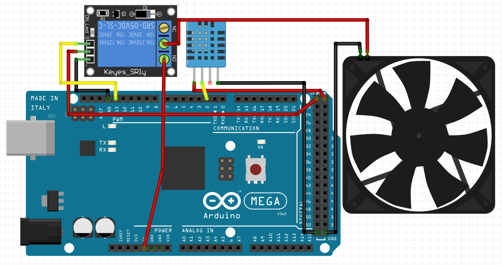

# Sistema de controle de temperatura

Neste sistema, são utilizados, o sensor de temperatura DHT11, o relé, e um cooler. De acordo com o código escrito, quando o ambiente chega a determinada temperatura (neste caso maior que 29 °C), o relé recebe a um sinal do sistema e cria um curto, ligando o cooler que neste caso representa um condicionador de ar. Para o teste, o cooler não foi utilizado pois ainda não estava disponível, mas é possível ouvir o "click" do relé quando chega no limite de temperatura.

Segue abaixo um exemplo de como o circuito pode ser montado.



Ao juntar o circuito exemplicado acima com o código que vem em seguida, é possível de ter o sistema funcional.

Código utilizado:
```C
//Inclui a biblioteca
#include <DHT.h>

//Pino digital onde está conectado o sensor
#define DHT11PIN 2
//Modelo do DHT
#define DHTTYPE  DHT11

// Define o pino "13" onde o relé está conectado
#define RELE 13

DHT dht(DHT11PIN, DHTTYPE);

// Função setup é executada apenas uma vez
void setup() {
  // inicia a comunicação serial a 9600 bits por segundo
  Serial.begin(9600);
  // imprime uma mensagem inical
  // funcação F é uma indicação para manter a mensagem
  // na memória flash para economizar memória.
  Serial.println(F("Teste do DHT!"));
  // inicializa classe do sensor
  dht.begin();

  // Configura o pino do relé como saída
  pinMode (RELE, OUTPUT);

}

// Função loop é para executar repetidamente o código
void loop()
{
  tarefa_1();
}

/* Essas variáveis são globais pois é necessário
   manter os valores independente do contexto de
   execução da função tarefa_1 */
const unsigned long periodo_tarefa_1 = 2000;
unsigned long tempo_tarefa_1 = millis();


//Envia os valores interios para o PC
void tarefa_1() {
  unsigned long tempo_atual = millis ();

  //Hora de enviar os dados caso tenha passado 2000 ms
  if (tempo_atual - tempo_tarefa_1 > periodo_tarefa_1) {
    // Lê a temperatura em Celsius
    float t = dht.readTemperature();


    // Verifica se alguma leitura falhou
    if (isnan(t)) {
      Serial.println(F("Falha ao ler o sensor DHT!"));
      return;
    }
    Serial.print("Valor : ");
    Serial.println(t);
        
    // Envia para o computador (serial) os dados
    if (t > 29)
      digitalWrite(RELE, LOW);
    else
      digitalWrite(RELE, HIGH);
  }
}
```
Abaixo há uma imagem no circuito montado e funcional.

