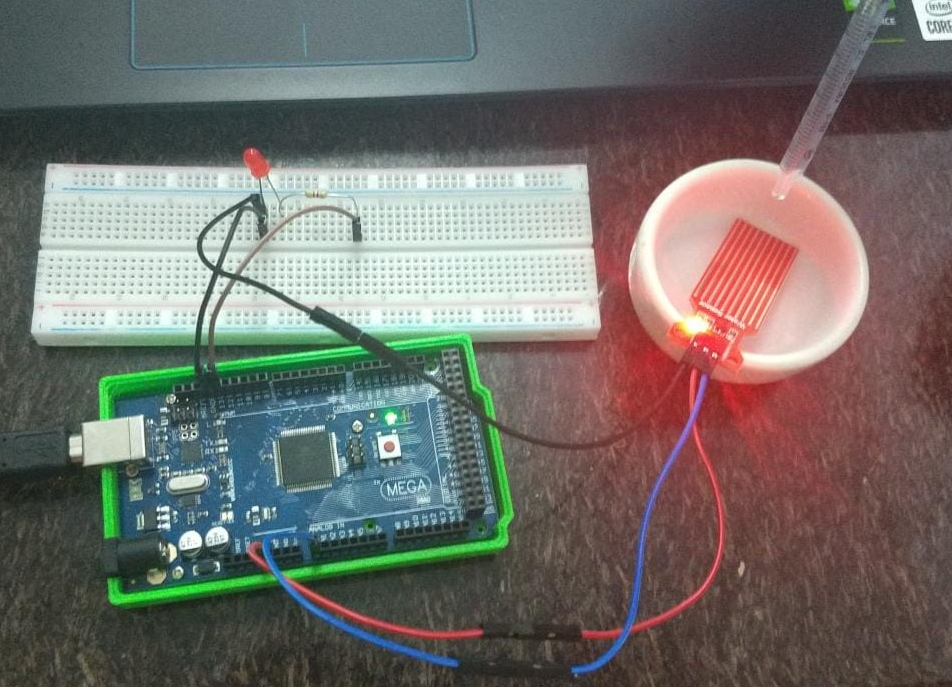

# Módulo Sensor de Umidade/Nível Água Chuva

Este módulo possui várias trilhas paralelas que funcionam como resistência, e a detecção de água acontece quando há o contato das das trilhas com água, alterando a resistência e enviando um valor de forma analógica ao arduíno.

Para mostrar o módulo funcionando, foi realizada a programação para que um LED se acendesse após o sensor enviar um valor analógico (300 ou mais) ao arduíno.
Seguem abaixo imagens do momento em que o sensor está seco, e depois quando recebe uma gota de água.

Nestas duas primeiras imagens, temos o sensor seco, e na saída serial conseguimos perceber que ele marca 0.

 

Já nestas duas outras imagens, pingamos uma gota de água no sensor, aí então o LED acende e ele começa a marcar valores de 300 ou mais na saída serial.

 

Tanto o código utilizado para realizar o teste quanto o tutorial de montagem, estão no repositório disponibilizado pelos professores neste link:
<https://github.com/LPAE/arduino_tutorial/tree/main/agua>

