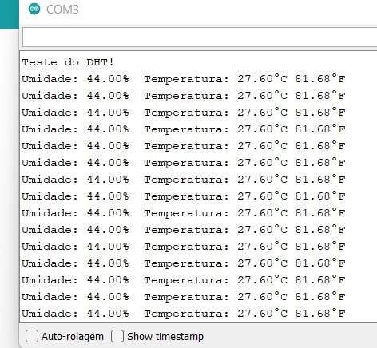

# Sensor de Umidade e Temperatura DHT11
O sensor DHT11, faz a aferição da temperatura e da humidade do local e retorna o valor pela comunicação serial. Para demonstração do teste, o retorno é mostrado na janela de comunicação serial do arduino.

Segue abaixo o circuito montado e o resultado na tela do arduino.

 

Tanto o código utilizado para realizar o teste quanto o tutorial de montagem, estão no repositório disponibilizado pelos professores neste link:
<https://github.com/LPAE/arduino_tutorial/tree/main/dht11>
