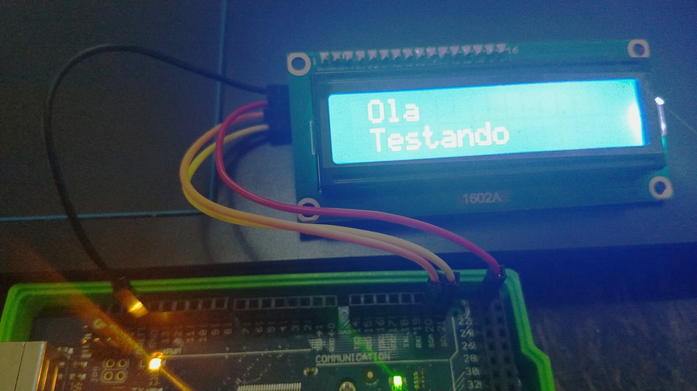

# Display LCD 16×2 I2C Backlight Azul

Para este display de LCD, foram necessárias as conexões de 4 pinos, os 2 de alimentação (VCC e GND) e outros dois de comunicação serial SDA e SCL, além da biblioteca LiquidCrystal_I2C.

Para o teste, o display foi conectado ao arduíno e assim que o código foi carregado ele passou a mostrar a mensagem configurada "ola" "testando".

A imagem abaixo mostra o display funcionando.

Tanto o código utilizado para realizar o teste quanto o tutorial de montagem, estão no repositório disponibilizado pelos professores neste link:
<https://github.com/LPAE/arduino_tutorial/tree/main/lcd>
