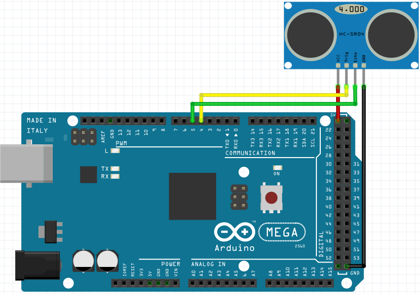
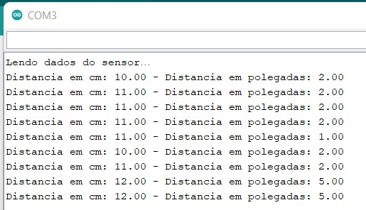

# Sensor ultrasônico HC-SR04
O sensor HC-SR04 utiliza do som para medir a distância do objeto até ele, para realizar a medição ele envia um pulso sonoro que vem pelo pino trigger, quando este pulso bate no objeto, ele volta, e é captado pelo sensor (pino echo), desta forma, o cálculo é feito pelo tempo que levou para o sinal voltar ao sensor da seguinte forma:

**Distância = ((tempo que o som levou para voltar) * (velocidade do som))/2**

Para conseguir realizar os testes, foi necessário instalar a biblioteca "Ultrasonic".

Segue abaixo como o circuito pode ser montado para funcionar sem precisar realizar ajustes no código.



Este é o código utilizado para o teste, foi encontrado [neste link](https://www.filipeflop.com/blog/sensor-ultrassonico-hc-sr04-ao-arduino/) e feitos alguns ajustes para funcionar com o Arduíno Mega e as atualizações da biblioteca.

```C
//Programa: Conectando Sensor Ultrassonico HC-SR04 ao Arduino
//Autor: FILIPEFLOP
 
//Carrega a biblioteca do sensor ultrassonico
#include <Ultrasonic.h>
 
//Define os pinos para o trigger e echo
#define pino_trigger 4
#define pino_echo 5

//Inicializa o sensor nos pinos definidos acima
Ultrasonic ultrasonic(pino_trigger, pino_echo);

void setup()
{
Serial.begin(9600);
Serial.println("Lendo dados do sensor…");
}

void loop()
{
//Le as informacoes do sensor, em cm e pol
float cmMsec, inMsec;
cmMsec = ultrasonic.distanceRead(CM);
inMsec = ultrasonic.distanceRead(INC);

//Exibe informacoes no serial monitor
Serial.print("Distancia em cm: ");
Serial.print(cmMsec);
Serial.print(" – Distancia em polegadas: ");
Serial.println(inMsec);

delay(1000);
}
```

Realizando as conexões ilustradas mais acima e compilando o código ajustado, ficamos com as imagens abaixo, onde temos o circuito montado e o retorno no monitor serial.


 

## Referência
FILIPEFLOP. **Filipeflop**. Disponível em: <https://www.filipeflop.com/>. Acesso em: 20 fev. 2022.

