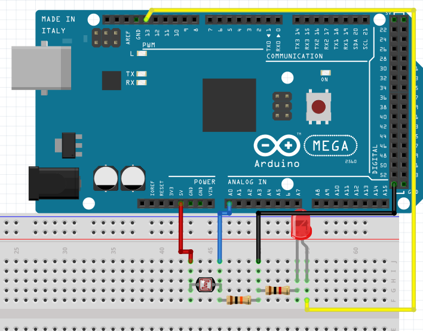
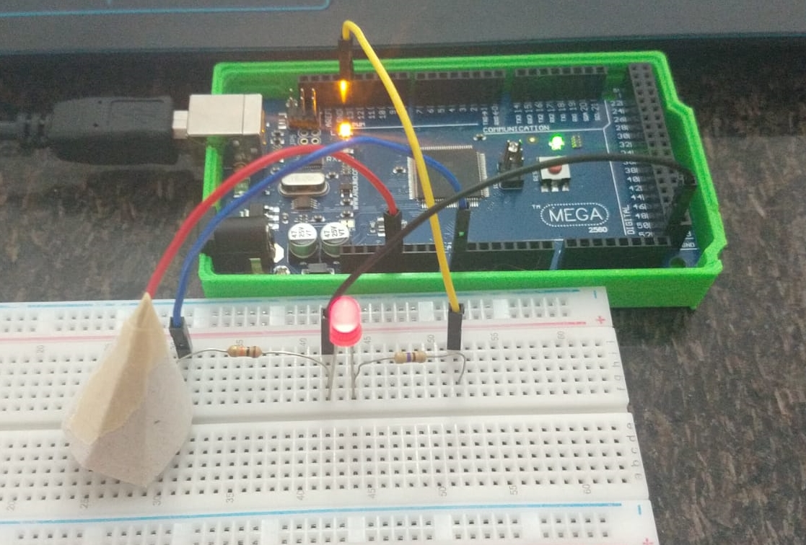

# Sensor de luminosidade LDR
O LDR é utilizado junto com um resistor, na conexão entre eles é puxado um pino para a entrada analógica do arduíno. Quanto maior a luminosidade que atinge o sensor, maior será o valor enviado para a entrada analógica do arduíno. O LDR acaba funcionando de forma muito semelhante ao [sensor de água](../agua_sensor/agua_sensor.md). Portanto, para testar ele, foi possível usar quase o mesmo código que foi usado no sensor de água, com a mudança de que o LED no caso acende quandoo sinal analógico que ele manda ao arduino for menor que o valor estipulado no código (neste caso 400).

As imagem abaixo mostram como o circuito pode ser montado para não precisar fazer nenhum ajuste no código código.



Segue abaixo o código modificado para funcionar com o LDR.

```C
// Define a entrada analógica 0 conectada ao sensor
#define PINO_LDR A0
// Define o pino "13" onde o LED está conectado
#define LED 13

// Função setup é executada apenas uma vez
void setup() {
  // inicia a comunicação serial a 9600 bits por segundo
  Serial.begin(9600);
  // Configura o pino do LED como saída
  pinMode (LED, OUTPUT);

}

/* Essas variáveis são globais pois é necessário
   manter os valores independente do contexto de
   execução da função tarefa_1 */
const unsigned long periodo_tarefa_1 = 1000;
unsigned long tempo_tarefa_1 = millis();

/* Tarefa 1: envia o valor analógico para o PC */
void tarefa_1() {
  unsigned long tempo_atual = millis();

  int valorSensor;

  /* Hora de enviar os dados analógicos caso tenha passado 1000 ms */
  if (tempo_atual - tempo_tarefa_1 > periodo_tarefa_1) {
    tempo_tarefa_1 = tempo_atual;

    valorSensor = analogRead(PINO_LDR);

    Serial.print("Valor : ");
    Serial.println(valorSensor);

    //Acender o LED de acordo com o valor da entrada analógica
    if (valorSensor < 400)
      digitalWrite(LED, HIGH);
    else
      digitalWrite(LED, LOW);

  }
}

/* Função loop() é responsável por escalonar as tarefas.
   Essa função é executada eternamente enquanto o Arduino estiver  energizado */
void loop() {

  tarefa_1();
```

Para testar o LDR, o circuito foi montado conforme a ilustração e foi feito uma espécie de "chapéu", para criar sombra e propositalmente fazer com que o valor do sinal analógico baixe.

 

