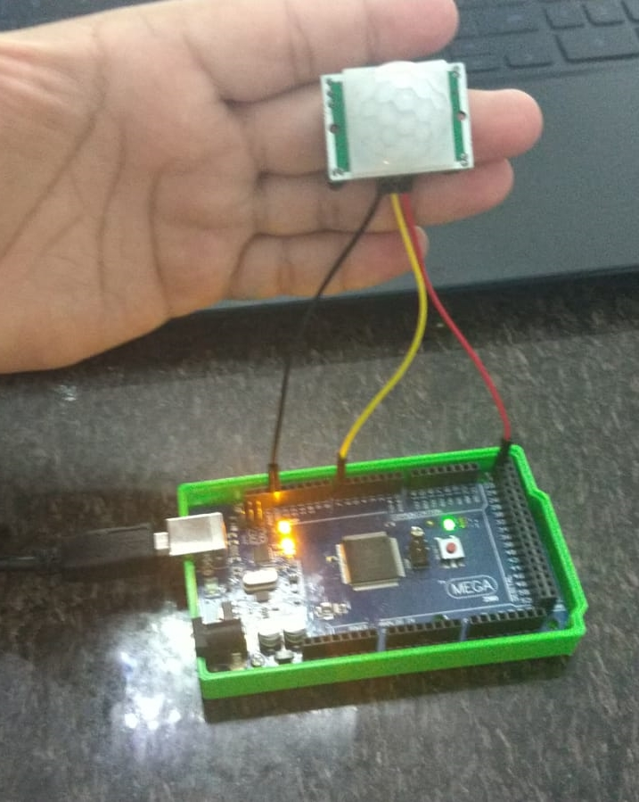

# Sensor de presença e movimento PIR
O Sensor PIR, ao detectar movimentação, muda o estado de sua porta digital.
No teste, após o arduíno receber a mudança de estado do sensor PIR, ele imprime na saída serial "movimento detectado".

Segue abaixo o circuito montado e o momento em que a detecção de movimento acontece no monitor serial.

 

Tanto o código utilizado para realizar o teste quanto o tutorial de montagem, estão no repositório disponibilizado pelos professores neste link:
<https://github.com/LPAE/arduino_tutorial/tree/main/pir>
