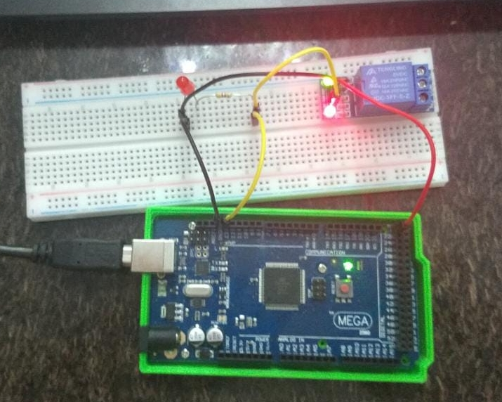

# Módulo Relé 5V
O módulo relé será utilizado para criar um curto, no momento em que receber o sinal que veio do arduino. Em nosso projeto ele irá ligar o cooler que representa o condionador de ar.
Para testar o relé, foi conectado um LED na mesma saída que manda sinal para ele. Neste caso, quando o LED está apagado, o relé está em circuito aberto, quando está aceso, o relé está em curto circuito.

 

Tanto o código utilizado para realizar o teste quanto o tutorial de montagem, estão no repositório disponibilizado pelos professores neste link:
<https://github.com/LPAE/arduino_tutorial/tree/main/rele>
